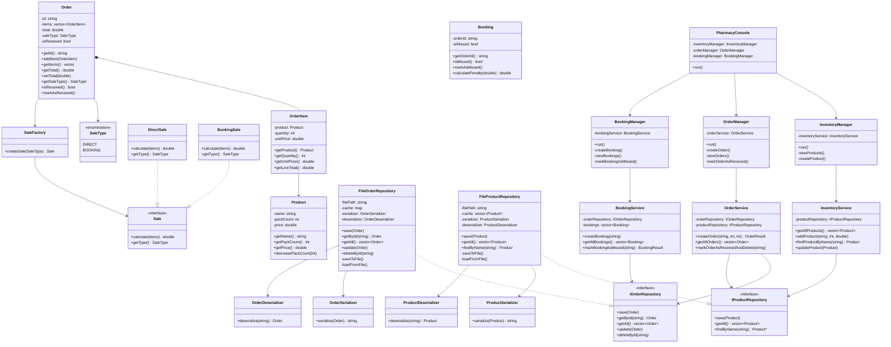

# Class Diagram

```mermaid
classDiagram
    direction TB

    class Product {
        -name: string
        -packCount: int
        -price: double
        +getName() string
        +getPackCount() int
        +getPrice() double
        +decreasePackCount(int)
    }

    class OrderItem {
        -product: Product
        -quantity: int
        -unitPrice: double
        +getProduct() Product
        +getQuantity() int
        +getUnitPrice() double
        +getLineTotal() double
    }

    class Order {
        -id: string
        -items: vector~OrderItem~
        -total: double
        -saleType: SaleType
        -isReceived: bool
        +getId() string
        +addItem(OrderItem)
        +getItems() vector
        +getTotal() double
        +setTotal(double)
        +getSaleType() SaleType
        +isReceived() bool
        +markAsReceived()
    }

    class Booking {
        -orderId: string
        -isMissed: bool
        +getOrderId() string
        +isMissed() bool
        +markAsMissed()
        +calculatePenalty(double) double
    }

    class SaleType {
        <<enumeration>>
        DIRECT
        BOOKING
    }

    class Sale {
        <<interface>>
        +calculate(items) double*
        +getType() SaleType*
    }

    class DirectSale {
        +calculate(items) double
        +getType() SaleType
    }

    class BookingSale {
        +calculate(items) double
        +getType() SaleType
    }

    class SaleFactory {
        +createSale(SaleType) Sale*
    }

    class IOrderRepository {
        <<interface>>
        +save(Order)*
        +getById(string) Order*
        +getAll() vector~Order~*
        +update(Order)*
        +deleteById(string)*
    }

    class IProductRepository {
        <<interface>>
        +save(Product)*
        +getAll() vector~Product~*
        +findByName(string) Product**
    }

    class FileOrderRepository {
        -filePath: string
        -cache: map
        -serializer: OrderSerializer
        -deserializer: OrderDeserializer
        +save(Order)
        +getById(string) Order
        +getAll() vector~Order~
        +update(Order)
        +deleteById(string)
        -saveToFile()
        -loadFromFile()
    }

    class FileProductRepository {
        -filePath: string
        -cache: vector~Product~
        -serializer: ProductSerializer
        -deserializer: ProductDeserializer
        +save(Product)
        +getAll() vector~Product~
        +findByName(string) Product*
        -saveToFile()
        -loadFromFile()
    }

    class OrderSerializer {
        +serialize(Order) string
    }

    class OrderDeserializer {
        +deserialize(string) Order
    }

    class ProductSerializer {
        +serialize(Product) string
    }

    class ProductDeserializer {
        +deserialize(string) Product
    }

    class InventoryService {
        -productRepository: IProductRepository
        +getAllProducts() vector~Product~
        +addProduct(string, int, double)
        +findProductByName(string) Product*
        +updateProduct(Product)
    }

    class OrderService {
        -orderRepository: IOrderRepository
        -productRepository: IProductRepository
        +createOrder(string, int, int) OrderResult
        +getAllOrders() vector~Order~
        +markOrderAsReceivedAndDelete(string)
    }

    class BookingService {
        -orderRepository: IOrderRepository
        -bookings: vector~Booking~
        +createBooking(string)
        +getAllBookings() vector~Booking~
        +markBookingAsMissed(string) BookingResult
    }

    class InventoryManager {
        -inventoryService: InventoryService
        +run()
        -viewProducts()
        -createProduct()
    }

    class OrderManager {
        -orderService: OrderService
        +run()
        -createOrder()
        -viewOrders()
        -markOrderAsReceived()
    }

    class BookingManager {
        -bookingService: BookingService
        +run()
        -createBooking()
        -viewBookings()
        -markBookingAsMissed()
    }

    class PharmacyConsole {
        -inventoryManager: InventoryManager
        -orderManager: OrderManager
        -bookingManager: BookingManager
        +run()
    }

    Order *-- OrderItem
    OrderItem --> Product
    Order --> SaleType
    Order --> SaleFactory
    SaleFactory --> Sale
    DirectSale ..|> Sale
    BookingSale ..|> Sale
    
    FileOrderRepository ..|> IOrderRepository
    FileProductRepository ..|> IProductRepository
    
    FileOrderRepository --> OrderSerializer
    FileOrderRepository --> OrderDeserializer
    FileProductRepository --> ProductSerializer
    FileProductRepository --> ProductDeserializer
    
    InventoryService --> IProductRepository
    OrderService --> IOrderRepository
    OrderService --> IProductRepository
    BookingService --> IOrderRepository
    
    InventoryManager --> InventoryService
    OrderManager --> OrderService
    BookingManager --> BookingService
    
    PharmacyConsole --> InventoryManager
    PharmacyConsole --> OrderManager
    PharmacyConsole --> BookingManager
```

