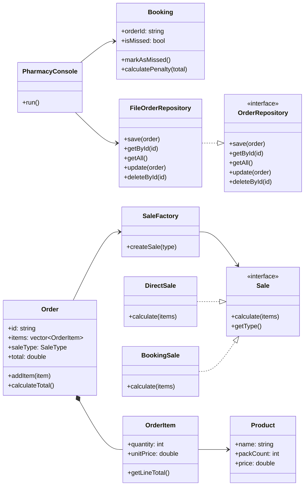

# Class Diagram

```mermaid
classDiagram
    direction LR

    class Product {
        +name: string
        +packCount: int
        +price: double
    }

    class OrderItem {
        +quantity: int
        +unitPrice: double
        +getLineTotal()
    }

    class Order {
        +id: string
        +items: vector~OrderItem~
        +saleType: SaleType
        +total: double
        +addItem(item)
        +calculateTotal()
    }

    class Booking {
        +orderId: string
        +isMissed: bool
        +markAsMissed()
        +calculatePenalty(total)
    }

    class SaleFactory {
        +createSale(type)
    }

    class Sale {
        <<interface>>
        +calculate(items)
        +getType()
    }

    class DirectSale {
        +calculate(items)
    }

    class BookingSale {
        +calculate(items)
    }

    class OrderRepository {
        <<interface>>
        +save(order)
        +getById(id)
        +getAll()
        +update(order)
        +deleteById(id)
    }

    class FileOrderRepository {
        +save(order)
        +getById(id)
        +getAll()
        +update(order)
        +deleteById(id)
    }

    class PharmacyConsole {
        +run()
    }

    Order *-- OrderItem
    OrderItem --> Product
    Order --> SaleFactory
    SaleFactory --> Sale
    DirectSale ..|> Sale
    BookingSale ..|> Sale
    FileOrderRepository ..|> OrderRepository
    PharmacyConsole --> FileOrderRepository
    PharmacyConsole --> Booking
```

## Патерни
- Factory: `SaleFactory` створює `DirectSale` або `BookingSale`.
- Repository: `OrderRepository` абстрагує збереження замовлень, реалiзацiя у `FileOrderRepository`.
