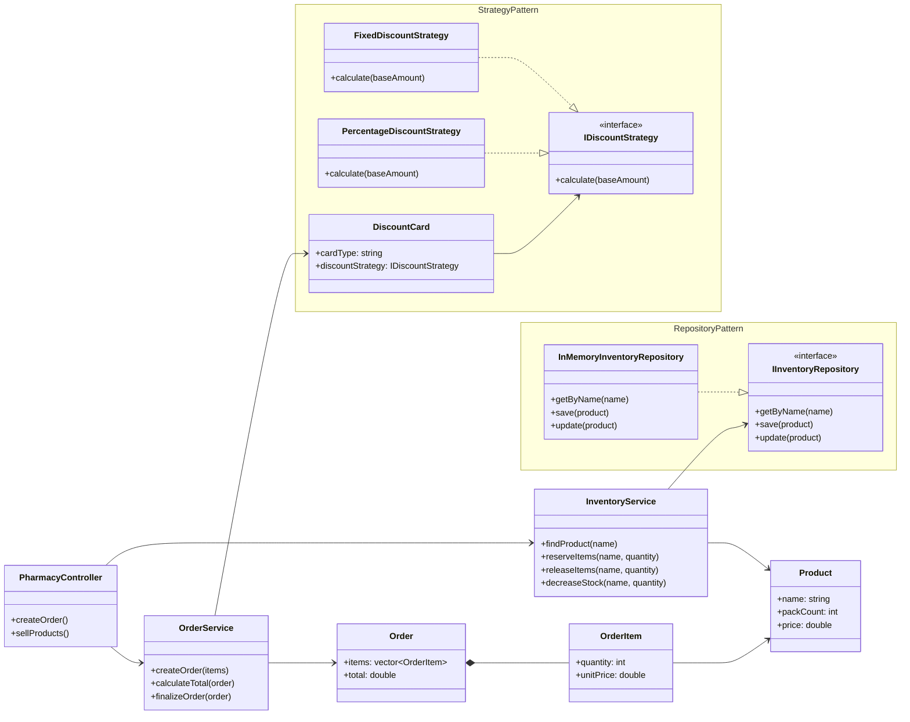

# Class Diagram

## Патерни
- Strategy: `IDiscountStrategy` дозволяє додавати нові типи знижок без зміни сервісів.
- Repository: `IInventoryRepository` відокремлює роботу зі складом від бізнес-логіки.
