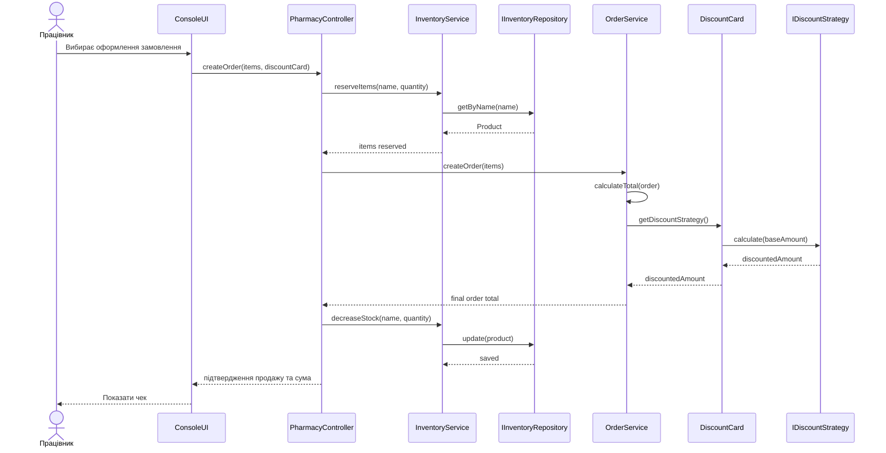

# Sequence Diagram

## Сценарій
Головний сценарій для першої ітерації: працівник створює замовлення або продаж, система перевіряє наявність препарату, списує кількість зі складу та рахує підсумкову суму з урахуванням дисконтної карти.

## Межі відповідальності
- UI тільки збирає дані та показує результат.
- Бізнес-логіка перевіряє склад, створює замовлення і рахує суму.
- Інфраструктура зберігає та оновлює дані про препарати.
