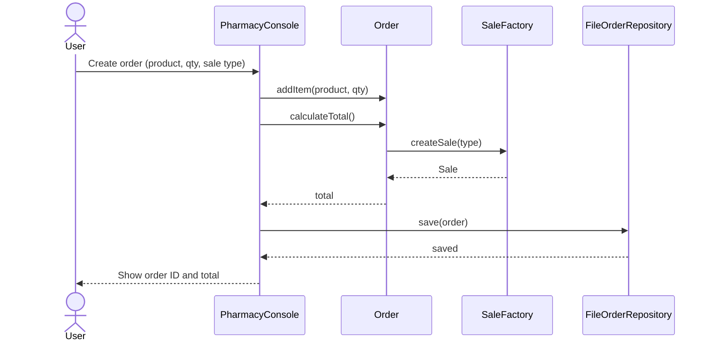

# Sequence Diagram

## Сценарiй
Користувач створює замовлення у консолi. Система рахує суму через Factory (DIRECT або BOOKING) i зберiгає замовлення у файловому репозиторiї.

## Межi вiдповiдальностi
- Console збирає данi та показує результат.
- Order рахує суму через SaleFactory.
- FileOrderRepository зберiгає замовлення у файл.
